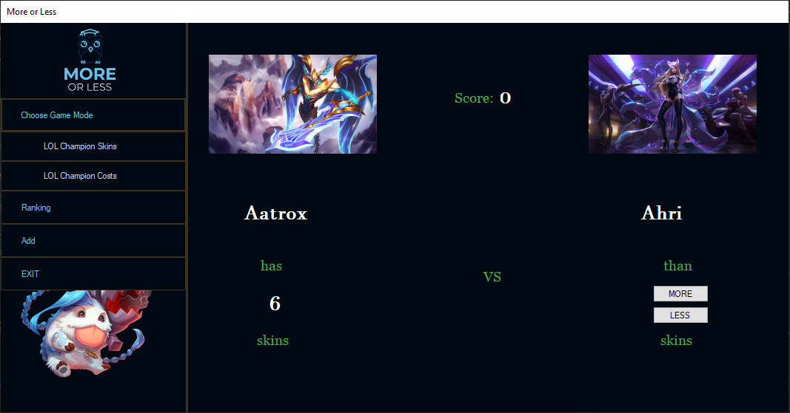
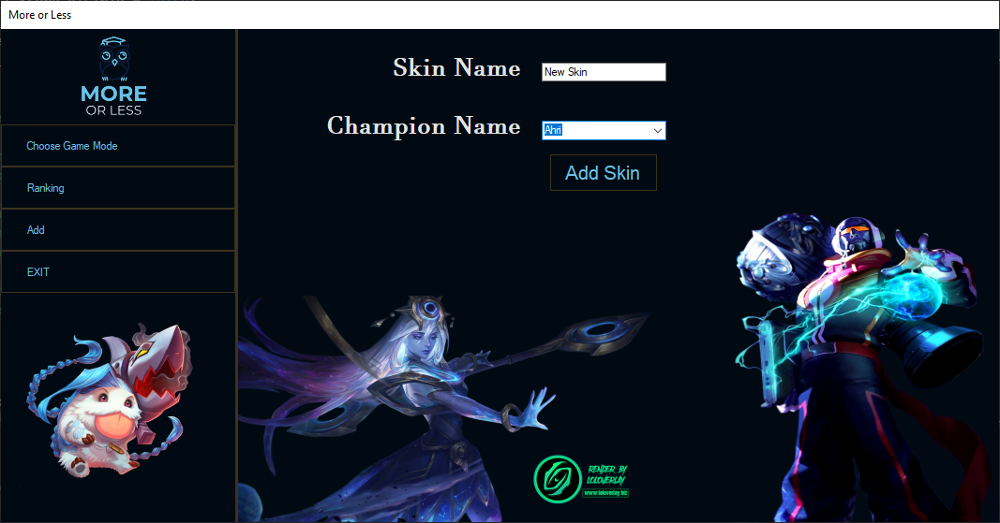
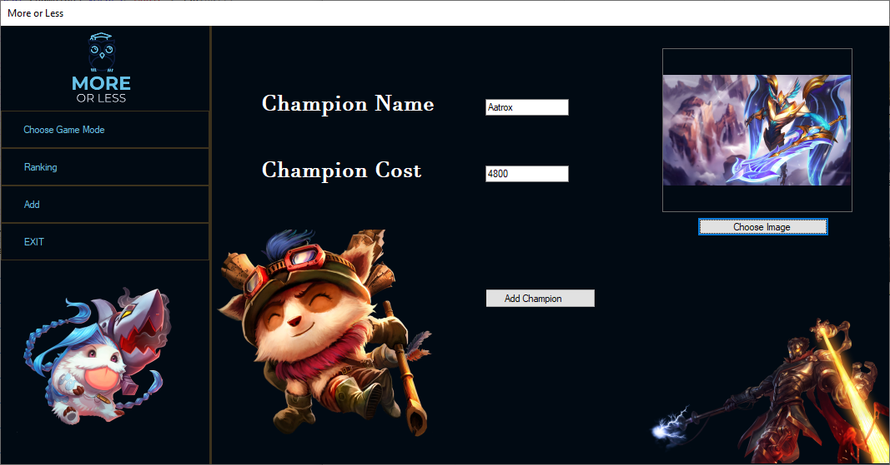
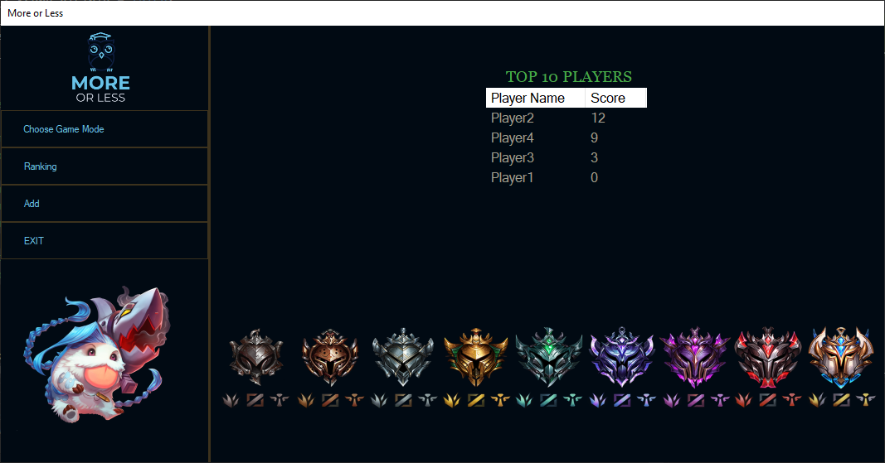

# MoreOrLess
Game: more or less
## Table of Contents
* [General Info](#general-informations)
* [Features](#features)
* [Screenshots](#screenshots)
* [Project Status](#project-status)
* [Contact](#contact)
## General Informations
In our scenario we have popular game League of Legends where user have to choose if champion A have more or less skins than champion B. If user chooses good option, he receives a point, else game is over and user can add score into ranking to check it later. UI lets user add more items into game when there are new things to add.
## Technologies Used
- Entity Framework
## Features
- Choose two games
- Check ranking
- Add new champion/skin
## Screenshots

## Project status
Project is: complete.
## Contact
Created by @szy.szymalski@gmail.com - feel free to contact me!

